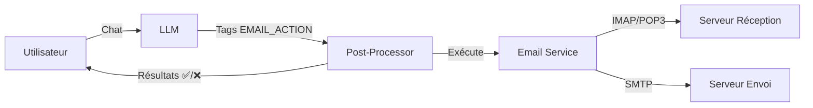

# Agent Email Nova — Documentation Technique

## Vue d'ensemble

L'agent email de Nova permet à l'IA de **lire, gérer et exécuter des actions** sur les emails de l'utilisateur via IMAP, POP3 et SMTP. Toute la configuration se fait via l'interface de settings, sans fichier `.env`.

## Architecture



### Flux d'exécution

1. L'utilisateur active l'agent email dans le chat (bouton ✉️)
2. `routes_chat.py` charge les emails via `list_emails()` → injecte le contexte + le prompt d'actions dans le **system prompt**
3. L'IA affiche les emails en **tableau Markdown** et inclut des tags `[EMAIL_ACTION:...]` si une action est demandée
4. Après génération, le **post-processor** parse les tags, exécute chaque action, nettoie le texte
5. Les résultats sont envoyés au frontend via **SSE** et affichés (✅/❌)

---

## Fichiers impliqués

### Backend

| Fichier | Rôle |
|---------|------|
| `app/services/email_service.py` | Service complet : connexions IMAP/POP3/SMTP, CRUD emails, exécution d'actions |
| `app/blueprints/api/routes_settings.py` | API config email (`GET/POST /config`, `POST /test`, `GET /presets`) |
| `app/blueprints/api/routes_chat.py` | Injection contexte + post-processing des tags d'action |

### Frontend

| Fichier | Rôle |
|---------|------|
| `app/blueprints/core/static/js/components/settings-page.js` | State Alpine.js + logique presets/save/test |
| `app/blueprints/core/templates/settings/content/email.html` | UI config : presets, protocole IMAP/POP3, serveurs, test |
| `app/blueprints/core/static/js/components/chat-app.js` | Parsing SSE `email_actions` + `email_context` |
| `app/blueprints/core/templates/partials/chat_content.html` | Affichage résultats actions (✅/❌) + emails consultés |

---

## Protocoles de réception

### IMAP vs POP3

| Fonctionnalité | IMAP | POP3 |
|---------------|------|------|
| Dossiers | ✅ | ❌ (INBOX uniquement) |
| Flags serveur (lu, flagged) | ✅ | ❌ |
| Recherche serveur | ✅ | ❌ |
| Sync bidirectionnelle | ✅ | ❌ |
| Archivage/déplacement | ✅ | ❌ |

### Sélection du protocole

L'interface settings propose un sélecteur visuel **IMAP / POP3**. Le choix est stocké dans `data/email.json` sous la clé `reception_protocol`.

### Routage automatique

Les fonctions `list_emails()` et `read_email()` routent automatiquement vers IMAP ou POP3 :

```python
def list_emails(folder=None, max_results=None, unread_only=False):
    config = _load_config()
    if config.get("reception_protocol") == "pop3":
        return _pop3_list_emails(max_results)
    return _imap_list_emails(folder, max_results, unread_only)
```

### Fonctions POP3

| Fonction | Description |
|----------|-------------|
| `_get_pop3_connection()` | Connexion POP3 SSL via `poplib` |
| `_pop3_list_emails(max_results)` | Liste les emails via commande `TOP` (headers uniquement) |
| `_pop3_read_email(uid)` | Lecture complète via commande `RETR` |

### Presets fournisseurs

Chaque preset (Gmail, Outlook, Yahoo, OVH, IONOS) pré-remplit automatiquement les champs POP3 :

| Fournisseur | Serveur POP3 | Port | Chiffrement |
|-------------|-------------|------|-------------|
| Gmail | `pop.gmail.com` | 995 | TLS |
| Outlook | `outlook.office365.com` | 995 | TLS |
| Yahoo | `pop.mail.yahoo.com` | 995 | TLS |
| OVH | `ssl0.ovh.net` | 995 | TLS |
| IONOS | `pop.ionos.fr` | 995 | TLS |

---

## Système d'Actions Email

### Principe

L'IA inclut des **tags structurés** dans sa réponse. Le backend les parse via regex et les exécute après la génération complète du stream.

### Tags disponibles

| Action | Tag | Fonction appelée |
|--------|-----|-----------------|
| Supprimer | `[EMAIL_ACTION:delete:uid=UID]` | `delete_email(uid)` |
| Archiver | `[EMAIL_ACTION:move:uid=UID:dest=Archive]` | `move_email(uid, "Archive")` |
| Déplacer | `[EMAIL_ACTION:move:uid=UID:dest=DOSSIER]` | `move_email(uid, dest)` |
| Marquer lu | `[EMAIL_ACTION:flag:uid=UID:action=add:flag=\Seen]` | `flag_email(uid, "add", "\Seen")` |
| Marquer non lu | `[EMAIL_ACTION:flag:uid=UID:action=remove:flag=\Seen]` | `flag_email(uid, "remove", "\Seen")` |
| Marquer important | `[EMAIL_ACTION:flag:uid=UID:action=add:flag=\Flagged]` | `flag_email(uid, "add", "\Flagged")` |
| Envoyer | `[EMAIL_ACTION:send:to=EMAIL:subject=SUJET:body=CONTENU]` | `send_email(to, subject, body)` |
| Répondre | `[EMAIL_ACTION:reply:uid=UID:body=CONTENU]` | `reply_email(uid, body)` |
| Répondre à tous | `[EMAIL_ACTION:reply_all:uid=UID:body=CONTENU]` | `reply_email(uid, body, reply_all=True)` |
| Transférer | `[EMAIL_ACTION:forward:uid=UID:to=EMAIL:body=NOTE]` | `forward_email(uid, to, body)` |
| Ajouter tag | `[EMAIL_ACTION:tag_add:uid=UID:tag=NOM]` | `add_tag(uid, tag)` |
| Retirer tag | `[EMAIL_ACTION:tag_remove:uid=UID:tag=NOM]` | `remove_tag(uid, tag)` |

### Fonctions d'exécution

| Fonction | Description |
|----------|-------------|
| `get_email_actions_prompt()` | Retourne le prompt d'instructions pour le system prompt |
| `parse_email_actions(text)` | Parse les tags `[EMAIL_ACTION:...]` via regex |
| `execute_email_action(action)` | Exécute une action unitaire, retourne `{success, message, action_type}` |
| `execute_all_email_actions(text)` | Parse + exécute tout + nettoie les tags du texte |

### Post-processing (routes_chat.py)

Après la génération complète du stream LLM :

```python
if email_context and "[EMAIL_ACTION:" in assistant_content:
    email_action_results, cleaned_content = execute_all_email_actions(assistant_content)
    assistant_content = cleaned_content  # Tags retirés du texte affiché
    # Envoi résultats au frontend via SSE
    yield f"data: {json.dumps({'email_actions': email_action_results})}\\n\\n"
```

Les résultats sont aussi sauvegardés dans `extra_data` du message pour l'historique.

---

## Configuration

### Stockage

La config est stockée dans `data/email.json`. Les mots de passe sont **chiffrés** via `crypto_service.encrypt_api_key()` avant stockage.

### Champs de configuration

| Clé | Type | Description |
|-----|------|-------------|
| `reception_protocol` | `"imap"` \| `"pop3"` | Protocole de réception |
| `imap_host` | string | Serveur IMAP |
| `imap_port` | int | Port IMAP (défaut: 993) |
| `imap_encryption` | `"ssl"` \| `"starttls"` \| `"none"` | Chiffrement IMAP |
| `pop3_host` | string | Serveur POP3 |
| `pop3_port` | int | Port POP3 (défaut: 995) |
| `pop3_encryption` | `"tls"` \| `"starttls"` \| `"none"` | Chiffrement POP3 |
| `smtp_host` | string | Serveur SMTP |
| `smtp_port` | int | Port SMTP (défaut: 587) |
| `smtp_encryption` | `"starttls"` \| `"ssl"` \| `"none"` | Chiffrement SMTP |
| `email_address` | string | Adresse email |
| `auth_type` | `"password"` \| `"oauth2"` | Type d'authentification |
| `password` | string (chiffré) | Mot de passe / mot de passe d'application |
| `default_folder` | string | Dossier par défaut (défaut: INBOX) |
| `max_emails` | int | Nombre max d'emails chargés (défaut: 10) |

### API Routes

| Méthode | Route | Description |
|---------|-------|-------------|
| `GET` | `/api/settings/email/config` | Récupère la config (sans mots de passe en clair) |
| `POST` | `/api/settings/email/config` | Met à jour la config |
| `POST` | `/api/settings/email/test` | Teste la connexion IMAP/POP3 + SMTP |
| `GET` | `/api/settings/email/presets` | Liste les presets fournisseurs |

---

## Prompt System

Le prompt injecté dans le system du LLM contient :

1. **Instruction générale** — "Tu as accès aux emails récents de l'utilisateur..."
2. **Contexte email** — Liste formatée des emails (UID, sujet, expéditeur, date, flags)
3. **Instructions de présentation** — Afficher en tableau Markdown, pas de résumé sauf si demandé
4. **Tags d'action** — Liste des tags disponibles avec syntaxe exacte

### Exemple de prompt injecté

```
Tu as accès aux emails récents de l'utilisateur. Tu peux les lire, y répondre,
les transférer, les trier, les supprimer, les taguer, et rédiger de nouveaux emails.

=== EMAILS RÉCENTS (INBOX) ===
1. [UID: 4523] ⭐📩 De: Jean Dupont <jean@example.com>
   Sujet: Réunion demain | Date: 2026-02-16
2. [UID: 4522] 📧 De: Amazon <noreply@amazon.fr>
   Sujet: Votre commande a été expédiée | Date: 2026-02-15
=== FIN EMAILS ===

PRÉSENTATION DES EMAILS :
- Affiche-les dans un TABLEAU MARKDOWN : | # | De | Sujet | Date | Lu |
- Ne fais JAMAIS de résumé sauf si demandé
...

ACTIONS EMAIL :
[EMAIL_ACTION:delete:uid=UID]
[EMAIL_ACTION:move:uid=UID:dest=DOSSIER]
...
```
